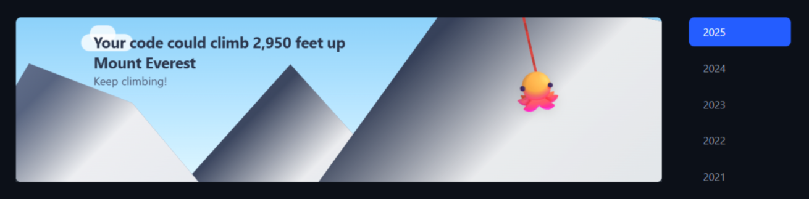

# Healthy Contribution Bar

A Chrome extension that reimagines GitHub's contribution graph to promote healthier coding habits and reduce productivity anxiety.

## Why This Extension?

GitHub's contribution graph can create unnecessary pressure and anxiety around daily coding streaks. **Healthy Contribution Bar** offers alternative ways to visualize your contributions—or hide them entirely—helping you focus on what really matters: building great things at your own pace.

> *Because squares are sharp.*

## Features

### Visualization Modes

**Quote Mode**
- Replaces the contribution graph with an inspirational quote
- Curated quotes about productivity, creativity, and healthy work habits

**Mountain Mode**
- Transforms your contributions into a mountain climbing journey on Everest
- Mountain landscape with a climbing Octocat
- 1 commit = 10 feet of elevation

**Fireflies Mode**
- Glowing fireflies
- Each contribution becomes a firefly
- 1 commit = 1 firefly

**XP Bar Mode**
- Gamified level system
- Four unlockable levels: Seedling -> Sprout -> Tree -> Forest
- Progressive difficulty: 50 XP -> 150 XP -> 500 XP -> 2000 XP
- 1 commit = 1 XP point

## Installation

### Chrome Web Store
Download here:
https://chromewebstore.google.com/detail/enmgbdodmfpilhbjeipheihmbjgmmacn?utm_source=item-share-cb

## How It Works

1. **Content Script**: Runs on all GitHub profile pages
2. **Username Detection**: Checks if the current profile matches your saved username
3. **Data Extraction**: Scrapes contribution count from GitHub's DOM
4. **Visualization**: Overlays your selected mode on top of the contribution graph
5. **Persistence**: Uses Chrome's storage API to save your preferences

### Tech Stack

- **React** + **TypeScript** - Popup interface
- **Vite** - Build tool and bundler
- **Vanilla JavaScript** - Content script for GitHub page manipulation
- **Chrome Extension Manifest V3** - Extension platform

## Contributing

Contributions are welcome. Feel free to submit a pull request.

## License

MIT License - Copyright (c) 2025 Henry Lodge

## Author

**Henry Lodge** | CS @ Northeastern University, Class of 2028

**Contact:**
 - GitHub: https://github.com/HenryLodge
 - LinkedIn: https://www.linkedin.com/in/henrylodge/
 - Email: hlcodes01@gmail.com

---

**Remember**: Your value as a developer isn't measured by a grid of green squares. Code with intention, rest without guilt, and grow at your own pace. 🌱